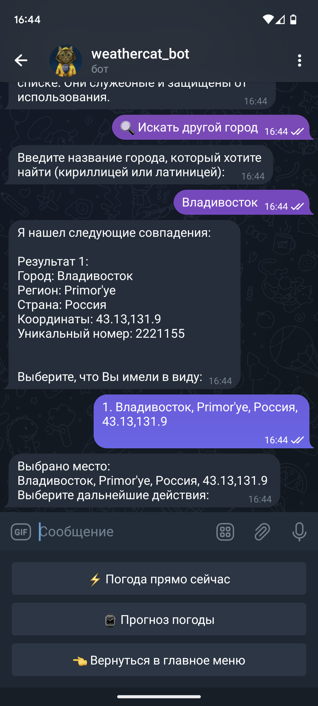
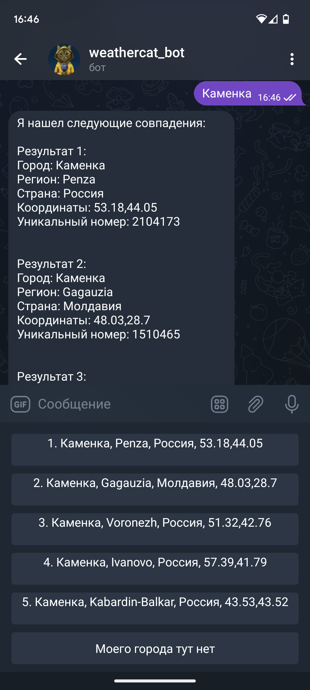
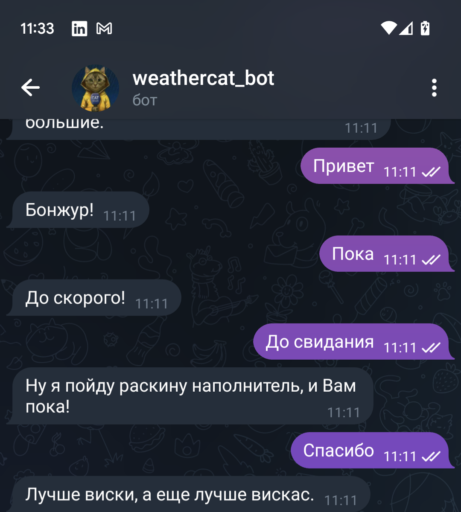

<!-- PROJECT LOGO -->
<br />
<div align="center">
  <a href="https://github.com/othneildrew/Best-README-Template">
    
  </a>

  <h3 align="center">WeatherCat Bot</h3>

  <p align="center">
    Превосходный бот, дающий прогноз погоды!

## О проекте

Почему именно этот бот:
* Русский и английский языки уже на борту, поддержка добавления новых языков присутствует
* Удобный и легкий интерфейс, с помощью которого пользователь сможет быстро найти нужную информацию
* Более 300000 городов и населенных пунктов МИРА, доступных здесь по одному запросу 
* Быстродействие благодаря оптимизированным строкам кода Python
* Умный отклик, базово очеловеченный ИИ готовит Вам примитивные ответы на благодарность, прощание, приветствие и так далее 

Если у Вас возникла проблема, или есть пожелания, напишите мне на почту: dmitriigoryachev58@gmail.com


### Powered by:

-


## Быстрый старт

В этой секции вам будет показано, как установить и настроить бота. Чтобы избежать ошибок, следуйте нижеприведенным указаниям:


### Установка

_Ниже приведены шаги для установки данного проекта на сервер/компьютер:_
ДИСКЛЕЙМЕР: Подразумевается, что на компьютере уже есть Python, и VCS Git
1. Загрузите репозиторий:
   ```sh
   git clone git@gitlab.skillbox.ru:dmitrii_goriachev_1/python_basic_diploma.git
   ```
2. Зайдите в репозиторий с помощью командной строки или IDE. Вам надо быть в корне: /python_basic_diploma

3. Введите данную команду:
   ```sh
   $ python -m pip --version
   $ python3 -m pip --version
   ```
   Если у вас нет менеджера библиотек, для Linux напишите:
   ```sh
   $ sudo apt install python3-pip
   $ sudo apt install python-pip
   ```
   Для остальных ОС смотрите, как установить pip: https://pypi.org/project/pip/
   
4. Все еще находясь в корне проекта, установите все библиотеки, которые требуются для работы программы:
   ```sh
   pip install -r requirements.txt
   ```

5. Программа обладает защитой от несанкционированного использования: запуск требует API ключей, которые есть только у меня. Обращайтесь на почту в секции контакты.

6. Запустите программу.

7. Найдите бота в Telegram: https://t.me/smart_weatherman_bot

## Примеры использования

* Запустите бота через скрипт main.py, нажмите СТАРТ и увидите неплохое приветственное описание:

-
* При нажатии на первую кнопку в панели вам выйдет гайд по командам:

-
* Ищите свой город по местоположению:

-
* Ищите любой другой город. Найдется многое:

-
-
* Есть населенные пункты, содержащие имя искомого, либо совпадающие с ним. Не волнуйтесь, бот умеет с этим работать:

-
* Бот чувствует Ваш настрой, и отвечает одной из 100 фраз, для повышения интерактивности:

-
* Бот различает благодарность, приветствие, прощание, просьбу о помощи, скринов с матом не будет, но на мат он тоже отвечает достойно

-


## Принять участие
Если есть предложения по улучшению бота, обращайтесь по моим контактам. Контакты находятся в секции "Контакты" 

## Лицензия

См. `license.txt`.

## Контакты

Dmitry Goryachev

* mailto: dmitriigoryachev58@gmail.com
* cellto: +996552479090
* Проект: https://gitlab.skillbox.ru/dmitrii_goriachev_1/python_basic_diploma
